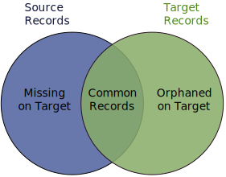

# ELT-Tools

## Database Abstraction

A set of tools to serve as an abstraction layer over many commonly used databases, as long
as it's supported by SQLAlchemy. It supports the following operations in an easy-to-use 
interface:

* count the number of rows in a table
* find duplicates in a table
* execute a sql query against a table
* insert records into a table

## ELT Pair Operations

In Extract-Load-Transform (ELT) operations, a table is extracted and loaded from one database
to another with potential transformations after that (for example in a database view). This is
akin to database replication, albeit not necessarily all tables nor all columns are transferred. 
One may also only transfer records from a certain date onwards. 

[comment]: <> ( ![alt text]\(images/source-target-venn.svg?raw=true\) )


Many common database engineering tasks relate to the source and target pairs. This library 
assists by implementing these commonly performed operations in a succinct interface such as:

* show a list of common table between source and target database
* compare counts between source and target tables over a specified time window
* find primary keys of missing records in the target
* fill missing records into the target over a given date range
* find primary keys of orphaned records in the target (i.e. corresponding records from the 
  source database have been deleted)
* remove orphaned records from target (even for large tables)

## Configuration and Examples
The library provides two main classes: `DataClient` for database abstraction and `ELTDBPair` for 
ELT operations between database pairs. The user passes configuration dictionaries into these classes.
The configuration describes database credentials, and details of which databases to pair up. 

For example, to find duplicate on a particular table:

```python

from os import environ
from elt_tools.client import DataClientFactory

DATABASES = {
    'db_key11': {
        'engine': 'oltp_engine',
        'sql_alchemy_conn_string': environ.get('mysql_db_uri'),
    },
    'db_key12': {
        'engine': 'bigquery_engine',
        'dataset_id': 'mydata',
        'gcp_project': environ.get('GCP_PROJECT'),
        'gcp_credentials': environ.get('GOOGLE_APPLICATION_CREDENTIALS'),
    },
}

factory = DataClientFactory(DATABASES)
client = factory(db_key='db_key11')
customer_duplicates = client.find_duplicate_keys('customers', 'id')
```

For example, to remove orphaned records on the target table of a particular ELT Pair
using a binary search strategy on a large table:

```python

from os import environ
from elt_tools.client import ELTDBPairFactory

DATABASES = {
    'db_key11': {
        'engine': 'oltp_engine',
        'sql_alchemy_conn_string': environ.get('mysql_db_uri'),
    },
    'db_key12': {
        'engine': 'bigquery_engine',
        'dataset_id': 'mydata',
        'gcp_project': environ.get('GCP_PROJECT'),
        'gcp_credentials': environ.get('GOOGLE_APPLICATION_CREDENTIALS'),
    },
}
ELT_PAIRS = {
    'pair1': {
        'source': 'db_key11', 'target': 'db_key12'
    },
}

factory = ELTDBPairFactory(ELT_PAIRS, DATABASES)
elt_pair = factory(pair_key='pair1')
customer_orphans = elt_pair.remove_orphans_from_target_with_binary_search(
    'customers', 
    'id', 
    timestamp_fields=['created_at']
)
```

## Installation instructions

```shell
$ pip install git+ssh://git@github.com/brightwrite/elt_tools.git
```

